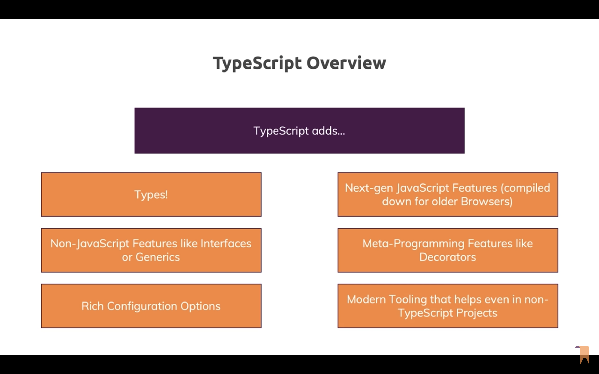
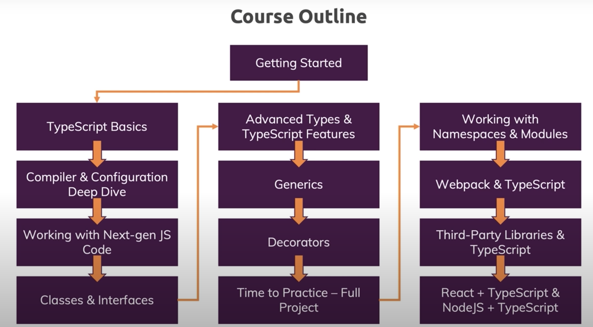
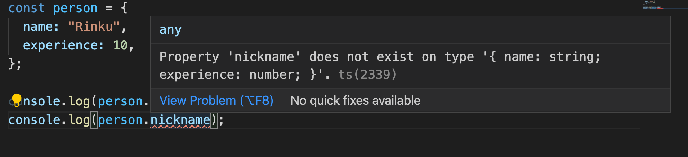

# typescript

Quick points on how to use typescript

# Feature

# Working with Types (Syntax & Features)

| Types       | Values                   | About                                                                                                       |
| ----------- | ------------------------ | ----------------------------------------------------------------------------------------------------------- |
| `number`    | 1, 1.5, -10              | int, float, double                                                                                          |
| `string`    | 'Hi', "Hello", \`Howdy\` | All text                                                                                                    |
| `boolean`   | true, false              | no thruthy / falsy values like 0, '', null etc - since this is decided in JS runtime                        |
| `object`    | { name: 'James' }        | All JS object (auto infer)                                                     |
| `array`     | []                       | Types can be flexible (type: any) or strict (number \| string)                                              |
| `tuple`     | []                       | Fixed length & type Array [number, string], No Auto inffer, Can be used as global constant with restriction |
| `enum`      | enum {K1, K2}            | Enumerated List starting with 0 or any number that is assiged                                               |
| `any`       | -                        | Any type, no specific type assignment - same as vanilla JS                                                  |
|             |                          |                                                                                                             |
| `union`     | type1 \| type2           | string \| number \| boolean                                                                                 |
| `literal`   | "direct-value"           | Having known extact value stored and not just type                                                          |
| `alias`     | any type combination     | Avoid duplicate type combination by creating Alias for same                                                 |
|             |                          |                                                                                                             |
| `undefined` | return;                  | if function returns undefined                                                                               |
| `void`      | no return                | if function with no return                                                                                  |
|             |                          |                                                                                                             |
| `unknown`   | Like "any"               | More restrictive type checking than "any"                                                                   |
| `never`     |                          | If JS execution is stopped (error thrown, infinite loop)                                                    |
|             |                          |                                                                                                             |

## Type Inference

Type inference -> identifying the type of variable
TS by default detects the type hence it is not good practice define the type of variable (at declaration) unless the variable is not assigned with values.
Ex.
-- `const num = 5;` --> Define type `number:5`
-- `let num = 5;` --> Define type `number`
-- `let num;` --> Define type as `any` --> Instead do `let num:number`

## Function

The return type of function is auto inferred, hence explicit assignment of type is not required

---

https://youtu.be/BwuLxPH8IDs?t=7689
